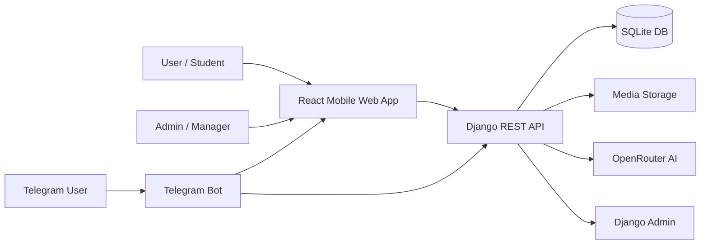
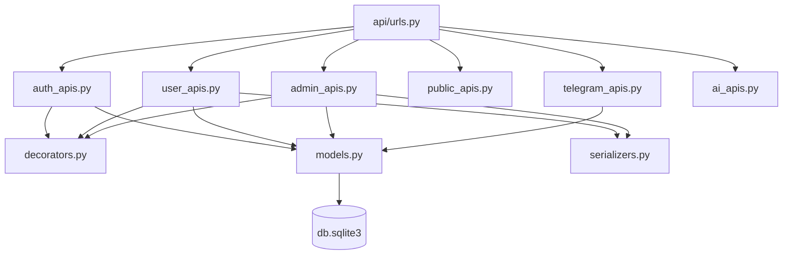
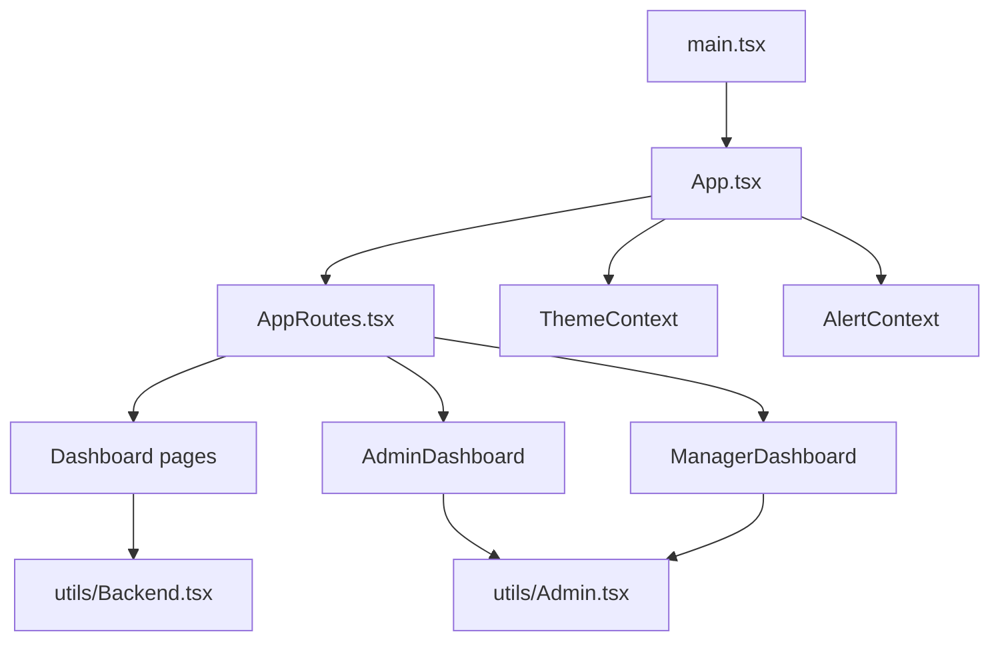
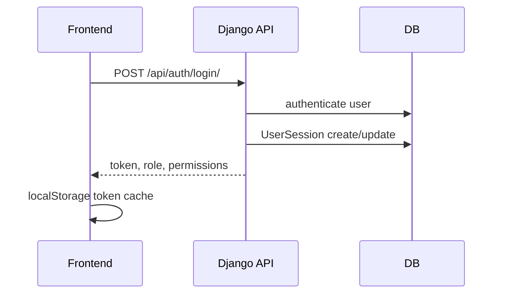
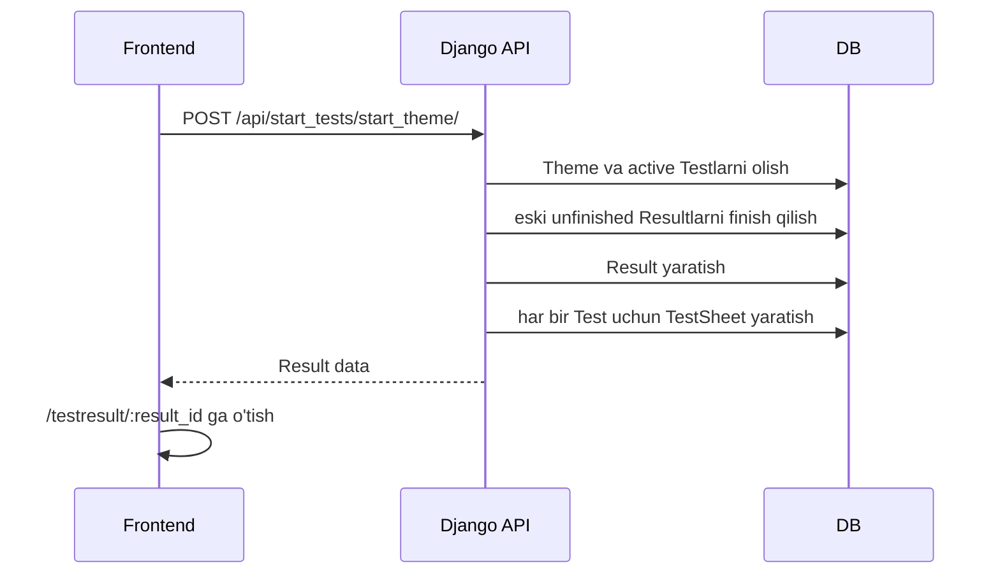
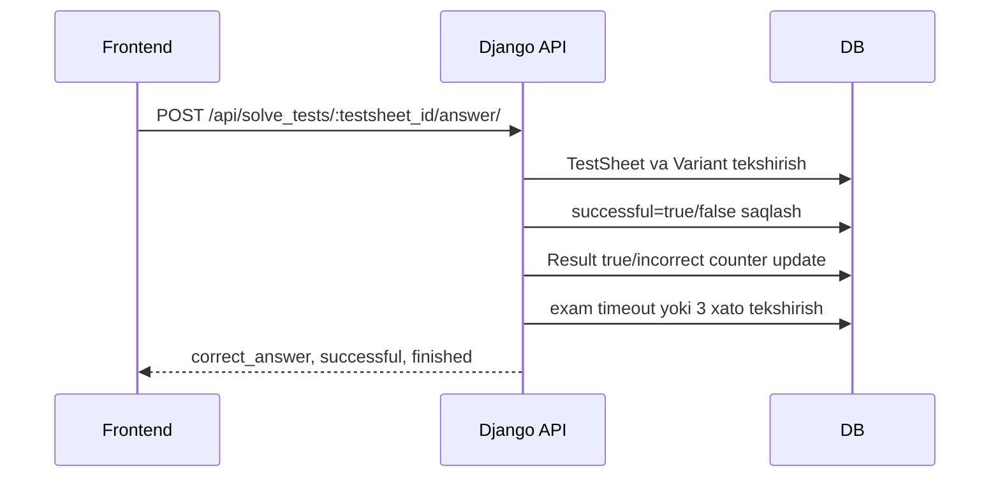

# 3. Tizim Arxitekturasi

## Yuqori darajadagi ko'rinish

## Modul chegaralari

| Modul | Papka | Mas'uliyat |
|-------|-------|------------|
| Backend config | `BackendAvtotester.uz/config` | URL, settings, WSGI/ASGI |
| API app | `BackendAvtotester.uz/api` | Model, serializer, view, decorator, admin |
| Bot | `BackendAvtotester.uz/Bot` | Telegram komandalar, Mini App tugmalari, account linking |
| Frontend app | `FrontAvtotester.uz/src` | User UI, admin UI, manager UI |
| Media | `BackendAvtotester.uz/media` | Test rasmlari va Telegram avatarlar |
| Static | `BackendAvtotester.uz/staticfiles`, `static` | DRF/admin static fayllar |

## Backend ichki arxitekturasi

## Frontend ichki arxitekturasi

## Request lifecycle

### Oddiy user login

### Mavzu bo'yicha test boshlash

### Javob yuborish

## Muhim data flow'lar

| Flow | Kirish | Chiqish | Muhim qoida |
|------|--------|---------|-------------|
| Login | username/password | custom UUID token | bir userga bitta `UserSession` |
| Start test | theme/ticket/count | `Result` | eski active sessiyalar yakunlanadi |
| Get tests | result_id | `TestSheet[]` | variant tartibi `variant_orders` orqali saqlanadi |
| Answer | testsheet_id + variant_id | correct/wrong | bir `TestSheet` faqat bir marta tanlanadi |
| Finish | result_id | final score | countlar `TestSheet`dan qayta hisoblanadi |
| Telegram connect | 6 xonali code | user.telegram_id | kod 10 daqiqa ichida amal qiladi |
| Admin CRUD | admin token | entity create/update/delete | manager permission bilan cheklanadi |

## Tizimdagi asosiy shartlar

| Shart | Amalga oshirilgan joy |
|-------|-----------------------|
| Foydalanuvchi tokeni `Authorization` headerda yuboriladi | `utils/Backend.tsx`, `decorators.py` |
| Admin/manager endpointlar `admin_required` orqali himoyalanadi | `decorators.py` |
| User endpointlar `user_required` orqali himoyalanadi | `decorators.py` |
| Django admin alohida `/admin/` URLda | `config/urls.py` |
| React admin panel `/admin/*` route'larda | `AppRoutes.tsx` |
| Manager panel `/manager/*` route'larda | `AppRoutes.tsx` |

## Arxitektura kuchli tomonlari

- Model va business logic backendda markazlashgan.
- Frontend user/admin/manager oqimlari route darajasida ajratilgan.
- Manager ruxsatlari backend va frontendda bir xil capability keylarga tayanadi.
- Bot web ilovani takrorlamaydi, balki Mini Appga kirish eshigi sifatida ishlaydi.
- Result va TestSheet ajratilgani sababli review, history va statistikani qurish oson.

## Arxitektura risklari

| Risk | Sabab | Tavsiya |
|------|-------|---------|
| DB hajmi ortishi | `TestSheet` soni juda katta | Postgres, indekslar, archive strategiyasi |
| API permission drift | Ba'zi endpointlarda user/admin decorator yo'q yoki open | Har bir endpoint uchun permission matrix test |
| Frontend token cache | localStorage ishlatiladi | XSS himoyasi, CSP va token rotatsiya |
| CORS keng | `CORS_ALLOW_ALL_ORIGINS=True` | Production whitelist |

