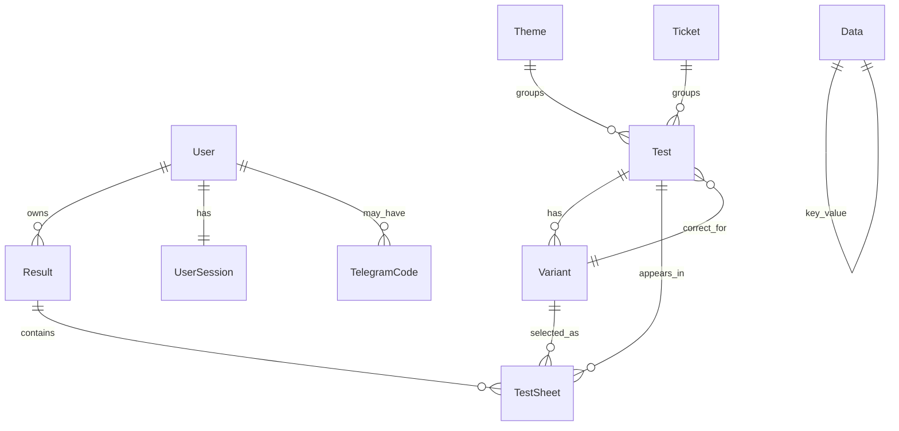

# 4. Ma'lumotlar Bazasi Sxemasi

## DB holati

Settings bo'yicha loyiha hozir SQLite ishlatadi:

```python
DATABASES = {
    "default": {
        "ENGINE": "django.db.backends.sqlite3",
        "NAME": BASE_DIR / "db.sqlite3",
        "OPTIONS": {"timeout": 30},
    }
}
```

`requirements.txt` ichida `psycopg2-binary` ham bor, bu Postgresga o'tish uchun texnik imkoniyat mavjudligini bildiradi.

## Entity relationship diagram



## Modellar

### User

`api.User` Django `AbstractUser`dan meros oladi.

| Field | Type | Izoh |
|-------|------|------|
| `username` | inherited | Login identifikatori |
| `password` | inherited | Django password hash |
| `full_name` | CharField | To'liq ism |
| `role` | CharField choices | `ADMIN`, `MANAGER`, `STUDENT` |
| `ruxsat` | BooleanField | Examga ruxsat |
| `permissions` | JSONField list | Manager capability keylari |
| `coloring` | JSONField dict | Ishlangan mavzu/biletlarni ranglash |
| `photo_url` | URLField | Telegram yoki profil rasmi |
| `activated_at` | DateTimeField | 30 kunlik obuna boshlanishi |
| `telegram_id` | BigIntegerField unique | Telegram account ID |
| `telegram_username` | CharField | Telegram username |

Muhim methodlar:

| Method | Vazifa |
|--------|--------|
| `is_expired()` | Student uchun 30 kunlik muddatni tekshiradi |
| `reactivate()` | `activated_at`ni hozirgi vaqtga qo'yadi |
| `days_remaining()` | Qolgan kunlar sonini qaytaradi |

### Theme

| Field | Type | Izoh |
|-------|------|------|
| `name` | CharField | Mavzu nomi |

Theme testlarni mavzu bo'yicha guruhlash uchun ishlatiladi.

### Ticket

| Field | Type | Izoh |
|-------|------|------|
| `name` | CharField | Bilet nomi yoki raqami |

Ticket testlarni bilet bo'yicha guruhlash uchun ishlatiladi. `Test.ticket` majburiy foreign key.

### Test

| Field | Type | Izoh |
|-------|------|------|
| `value` | TextField | Savol matni |
| `correct_answer` | FK Variant nullable | To'g'ri javob |
| `image` | ImageField | Savol rasmi |
| `active` | BooleanField | Test ishlatilishi mumkinmi |
| `random_order` | BooleanField | Variantlar random tartibda ko'rsatilsinmi |
| `theme` | FK Theme nullable | Mavzuga bog'lanish |
| `ticket` | FK Ticket | Biletga bog'lanish |
| `explanation` | TextField nullable | Umumiy savol izohi |
| `created_at` | DateTimeField | Yaratilgan vaqt |

Model qoidalari:

- `correct_answer` bo'lmasa `active=False`.
- Test o'chirilganda unga bog'langan rasm ham o'chiriladi.
- Rasm almashtirilganda eski rasm diskdan o'chiriladi.

### Variant

| Field | Type | Izoh |
|-------|------|------|
| `value` | TextField | Javob varianti |
| `test` | FK Test | Qaysi testga tegishli |
| `explanation` | TextField nullable | Variant uchun izoh |
| `created_at` | DateTimeField | Yaratilgan vaqt |

### Result

| Field | Type | Izoh |
|-------|------|------|
| `user` | FK User nullable SET_NULL | Natija egasi |
| `description` | TextField | Masalan `Exam 20 ta test`, `Ticket 1` |
| `test_length` | IntegerField | Savollar soni |
| `true_answers` | IntegerField | To'g'ri javoblar |
| `incorrect_answers` | IntegerField | Noto'g'ri javoblar |
| `test_type` | choices | `THEME`, `EXAM`, `TICKET`, `SETTEST` |
| `finished` | BooleanField | Test yakunlanganmi |
| `start_time` | DateTimeField | Boshlanish vaqti |
| `end_time` | DateTimeField nullable | Tugash vaqti |

### TestSheet

| Field | Type | Izoh |
|-------|------|------|
| `result` | FK Result | Qaysi natijaga tegishli |
| `test` | FK Test | Savol |
| `variant_orders` | JSONField | Variant ID tartibi |
| `current_answer` | FK Variant nullable | Tanlangan javob |
| `selected` | BooleanField | Javob tanlanganmi |
| `successful` | Boolean nullable | To'g'ri/noto'g'ri/null |
| `created_at` | DateTimeField | Yaratilgan vaqt |

Muhim: `variant_orders` birinchi yaratishda test variantlari IDlari bilan to'ldiriladi. Bu review sahifasida variant tartibi saqlanishiga yordam beradi.

### UserSession

| Field | Type | Izoh |
|-------|------|------|
| `user` | OneToOne User | Bitta userga bitta sessiya |
| `token` | UUIDField unique | Custom auth token |
| `device_info` | CharField nullable | User-Agent |
| `ip_address` | GenericIPAddressField nullable | IP |
| `created_at` | DateTimeField | Yaratilgan vaqt |
| `updated_at` | DateTimeField | Oxirgi admin accessda yangilanadi |

### TelegramCode

| Field | Type | Izoh |
|-------|------|------|
| `code` | CharField unique | 6 xonali kod |
| `user` | FK User nullable | Web user |
| `telegram_id` | BigIntegerField | Telegram ID |
| `telegram_username` | CharField nullable | Username |
| `photo_url` | URLField nullable | Avatar URL yoki media path |
| `first_name` | CharField nullable | Telegram first name |
| `last_name` | CharField nullable | Telegram last name |
| `created_at` | DateTimeField | Kod yaratilgan vaqt |

### Data

| Field | Type | Izoh |
|-------|------|------|
| `key` | CharField unique | Masalan `telegram_link` |
| `value` | CharField | Aloqa qiymati |

`Data` public connection ma'lumotlarini saqlaydi.

## Choices

| Choice | Qiymatlar |
|--------|-----------|
| `RoleChoices` | `ADMIN`, `MANAGER`, `STUDENT` |
| `TestChoices` | `THEME`, `EXAM`, `TICKET`, `SETTEST` |

Manager capability keylari:

| Key | Label |
|-----|-------|
| `users` | Foydalanuvchilar |
| `tests` | Testlar |
| `tickets` | Biletlar |
| `themes` | Mavzular |
| `endresults` | Natijalar |
| `allstats` | Statistika |
| `connections` | Murojatlar |

## Joriy DB statistikasi

| Jadval | Yozuv soni |
|--------|------------|
| `api_user` | 666 |
| `api_theme` | 45 |
| `api_ticket` | 61 |
| `api_test` | 1220 |
| `api_variant` | 3991 |
| `api_result` | 81722 |
| `api_testsheet` | 2293947 |
| `api_usersession` | 528 |
| `api_data` | 4 |
| `api_telegramcode` | 0 |

## Tavsiya etilgan indekslar

Katta hajmda querylar sekinlashmasligi uchun quyidagi indekslar foydali bo'lishi mumkin:

| Model | Fieldlar | Sabab |
|-------|----------|-------|
| Result | `user`, `start_time`, `finished`, `test_type` | History, stats, ranking |
| TestSheet | `result`, `test`, `successful`, `selected` | Result detail va score hisoblash |
| Test | `ticket`, `theme`, `active` | Start test querylari |
| User | `role`, `ruxsat`, `telegram_id` | Admin filter va Telegram linking |
| TelegramCode | `code`, `telegram_id`, `created_at` | 10 daqiqalik code lookup |

