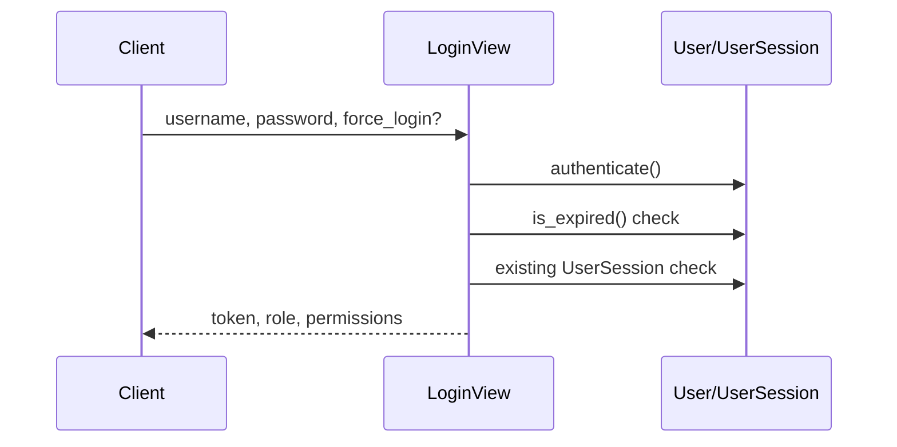

# 6. Autentifikatsiya va Avtorizatsiya

## Auth modeli

Loyiha DRF TokenAuthenticationni settingsga qo'shgan, lekin amalda custom `UserSession` modeli orqali UUID token ishlatadi.



## Login oqimi

Endpoint:

```http
POST /api/auth/login/
```

Request:

```json
{
  "username": "student",
  "password": "secret",
  "force_login": false,
  "photo_url": "optional telegram photo"
}
```

Response:

```json
{
  "token": "uuid-token",
  "message": "Login successful",
  "role": "STUDENT",
  "permissions": []
}
```

## Device conflict

`LoginView` bitta user uchun bitta `UserSession` saqlaydi. Agar session boshqa `device_info` bilan aktiv bo'lsa:

| Holat | Natija |
|-------|--------|
| `force_login=false` | 403 `DEVICE_CONFLICT` |
| `force_login=true` | Eski session o'chiriladi, yangi token yaratiladi |
| `device_info` bir xil | Existing token qaytariladi |

Device info frontenddan emas, request headerdagi `User-Agent`dan olinadi.

## Logout oqimi

Endpoint:

```http
POST /api/auth/logout/
Authorization: <token>
```

Logout sessionni o'chirmaydi, balki `device_info=None` qilib qo'yadi. Bu keyingi loginlarda token qayta ishlatilishiga imkon beradi.

## Role modeli

Backend role choices:

| Role | Tavsif |
|------|--------|
| `ADMIN` | To'liq boshqaruv |
| `MANAGER` | Permission list orqali cheklangan boshqaruv |
| `STUDENT` | Oddiy foydalanuvchi |

Frontend UI:

| Backend role | UI ko'rinishi |
|--------------|---------------|
| `ADMIN` | Admin |
| `MANAGER` | Manager |
| boshqa | Talaba |

## User decorator

`user_required` quyidagilarni bajaradi:

1. `Authorization` headerni tekshiradi.
2. `Token ` yoki `Bearer ` prefixlarini olib tashlaydi.
3. `UserSession.token` orqali session topadi.
4. `request.user = session.user` qiladi.

Xatoliklar:

| Holat | Status | Response |
|-------|--------|----------|
| Header yo'q | 401 | `Authorization header missing` |
| Token topilmadi | 401 | `Invalid or expired token` |

## Admin decorator

`admin_required` role va manager permissionlarni tekshiradi.

Permission qiymatlari:

| Qiymat | Ma'nosi |
|--------|---------|
| `None` | Faqat admin/staff |
| `*` | Har qanday admin yoki manager |
| `key` | Admin yoki `permissions` ichida shu key bor manager |

Decorator view classdagi `panel_perm` atributidan permission oladi.

## Manager permissions

| Key | Panel bo'limi |
|-----|---------------|
| `users` | Foydalanuvchilar |
| `tests` | Testlar |
| `tickets` | Biletlar |
| `themes` | Mavzular |
| `endresults` | Natijalar |
| `allstats` | Statistika |
| `connections` | Murojatlar |

Manager yaratish:

```http
POST /api/admin/manager/
Authorization: <admin-token>

{
  "username": "manager1",
  "password": "secret",
  "full_name": "Manager One",
  "permissions": ["users", "tests"]
}
```

Manager o'z imkoniyatlarini olish:

```http
GET /api/manager/me/
```

Response:

```json
{
  "id": 3,
  "full_name": "Manager One",
  "role": "MANAGER",
  "permissions": ["users", "tests"],
  "capabilities": [
    {"key": "users", "label": "Foydalanuvchilar"}
  ]
}
```

## Obuna tekshiruvi

Login paytida:

```python
if hasattr(user, "is_expired") and user.is_expired():
    return 403 EXPIRED
```

`User.is_expired()` qoidasi:

| User turi | Expire |
|-----------|--------|
| Admin | Yo'q |
| Manager | Yo'q |
| Staff/superuser | Yo'q |
| Student | `activated_at + 30 kun`dan keyin |

## Exam ruxsati

Student exam boshlashi uchun `ruxsat=True` bo'lishi kerak. Admin/staff yoki ADMIN role bundan mustasno.

```http
POST /api/start_tests/start_exam/
```

`ruxsat=False` bo'lsa:

```json
{
  "error": "Imtihonga ruxsat berilmagan. Iltimos, admin bilan bog'laning."
}
```

## Frontend auth cache

Frontend quyidagilarni `localStorage`ga yozadi:

| Key | Qiymat |
|-----|--------|
| `token` | Auth token |
| `userRole` | Role |
| `userFullName` | Foydalanuvchi ismi |
| `userPermissions` | Manager permissions JSON |

401 status qaytsa frontend local auth cache tozalaydi va `/login`ga yo'naltiradi.

## Permission matrix

| Endpoint guruhi | Student | Manager | Admin |
|-----------------|---------|---------|-------|
| Profile | Ha | Ha | Ha |
| Themes/Tickets user list | Ha | Ha | Ha |
| Start/Solve test | Ha | Ha | Ha |
| Admin dashboard | Yo'q | `*` | Ha |
| Users CRUD | Yo'q | `users` | Ha |
| Tests CRUD | Yo'q | `tests` | Ha |
| Themes CRUD | Yo'q | `themes` | Ha |
| Tickets CRUD | Yo'q | `tickets` | Ha |
| Connections PUT | Yo'q | `connections` | Ha |
| Manager create | Yo'q | Yo'q | Ha |

## Tavsiyalar

1. Logoutda sessionni to'liq revoke qilish yoki token rotation qo'shish.
2. Tokenni DBda plain UUID emas, hash ko'rinishida saqlash.
3. Frontend localStorage o'rniga xavfsizroq strategiya ko'rib chiqish.
4. Role enumini frontend va backendda yagona source of truth qilish.
5. Barcha sensitive endpointlar uchun automated permission tests yozish.

