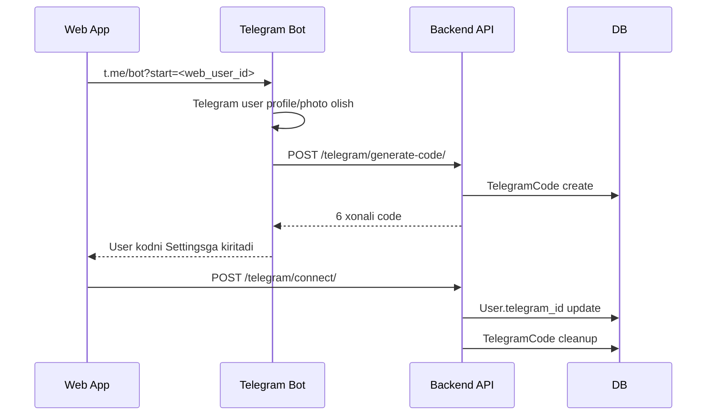

# 7. Telegram Bot Moduli

## Modul maqsadi

Telegram bot AvtoTester.uz web ilovasiga tez kirish va web akkauntni Telegram bilan bog'lash uchun ishlatiladi. Bot asosiy test logikasini o'zida bajarmaydi; u Mini App tugmalari va verification code oqimini boshqaradi.

## Fayllar

| Fayl | Vazifa |
|------|--------|
| `Bot/main.py` | Aiogram botni ishga tushirish |
| `Bot/config.py` | Token, URL, admin ID va metadata |
| `Bot/handlers.py` | `/start`, `/help`, `/info`, `/connect` va callbacklar |
| `Bot/keyboards.py` | Inline keyboard va WebApp buttonlar |
| `Bot/messages.py` | HTML message template'lar |
| `Bot/requirements.txt` | Bot dependency'lari |

## Texnologiya

| Qism | Qiymat |
|------|--------|
| Framework | Aiogram 3.7.0 |
| HTTP client | aiohttp |
| Parse mode | HTML |
| WebApp URL | `https://avtotester.uz` |
| Backend API default | `http://127.0.0.1:8011/api` |

## Komandalar

| Komanda | Vazifa |
|---------|--------|
| `/start` | Start menu va Mini App tugmasini ko'rsatadi |
| `/start <web_user_id>` | Web user uchun Telegram linking code yaratadi |
| `/help` | Yordam matni |
| `/info` | Bot haqida ma'lumot |
| `/connect` | 6 xonali linking code yaratadi |

## Keyboardlar

### Oddiy user keyboard

| Tugma | Harakat |
|-------|---------|
| `Test ishlash uchun bosing` | `FRONTEND_URL` Mini App ochadi |
| `Yordam` | `help` callback |
| `Ma'lumot` | `info` callback |
| `Xatolik haqida xabar bering` | Developer bilan bog'lanish |

### Admin keyboard

| Tugma | URL |
|-------|-----|
| Test boshlash | `/` |
| Dashboard | `/admin/dashboard` |
| Foydalanuvchilar | `/admin/users` |
| Statistika | `/admin/statistics` |
| Natijalar | `/admin/results` |
| Mavzular | `/admin/themes` |
| Biletlar | `/admin/tickets` |
| Testlar | `/admin/tests` |
| Murojatlar | `/admin/connections` |

## Account linking oqimi



## Backend Telegram endpointlari

| Endpoint | Method | Himoya | Vazifa |
|----------|--------|--------|--------|
| `/api/telegram/generate-code/` | POST | Ochiq/internal | 6 xonali kod yaratish |
| `/api/telegram/status/` | GET | User token | Web user uchun aktiv kodni tekshirish |
| `/api/telegram/connect/` | POST | User token | Kod orqali userni Telegramga bog'lash |
| `/api/telegram/disconnect/` | POST | User token | Telegram bog'lanishni uzish |

## Code qoidalari

| Qoida | Izoh |
|-------|------|
| Kod formati | 6 xonali raqam |
| Unique | `TelegramCode.code` unique |
| Muddati | 10 daqiqa |
| Cleanup | Telegram ID bo'yicha eski kodlar o'chiriladi |
| Duplicate check | Telegram ID boshqa userga ulangan bo'lsa rad etiladi |

## Avatar saqlash

`/start <web_user_id>` oqimida bot Telegram profil rasmini olib, backend media ichida saqlaydi:

```text
BackendAvtotester.uz/media/telegram_avatars/tg_avatar_<telegram_id>.jpg
```

`photo_url` user profiliga saqlanishi mumkin.

## Mini App integratsiyasi

Frontend `App.tsx` Telegram WebApp API bilan ishlaydi:

| Funksiya | Vazifa |
|----------|--------|
| `tg.ready()` | Mini App tayyorligini bildiradi |
| `tg.expand()` | Ekranni kengaytiradi |
| `BackButton.show/hide` | Native back button |
| `HapticFeedback` | UI feedback |
| `enableClosingConfirmation()` | Yopishda tasdiqlash |

## E'tiborli nomuvofiqliklar

| Joy | Hozirgi holat | Tavsiya |
|-----|---------------|---------|
| `Bot/config.py` | Default `BOT_TOKEN` kodda bor | Tokenni koddan olib tashlash |
| `utils/Backend.tsx` | `getConnectBotUrl` `root409bot`ni qaytaradi | Amaldagi bot username bilan birxillashtirish |
| `Bot/keyboards.py` | `MINI_APP_URL` bor, lekin WebAppInfo `FRONTEND_URL` ishlatadi | Keraksiz configni tozalash yoki izohlash |
| Admin check | Bot `/public/connection/?telegram_id=`dan role kutadi, lekin endpoint role qaytarmaydi | Admin aniqlash logikasini backendda alohida endpoint qilish |

## Ishga tushirish

```bash
cd BackendAvtotester.uz/Bot
pip install -r requirements.txt
BOT_TOKEN=xxx BACKEND_API_URL=http://127.0.0.1:8011/api python main.py
```

## Production tavsiyalar

1. Botni `systemd` service sifatida yuritish.
2. `BOT_TOKEN`ni faqat envdan olish.
3. `BACKEND_API_URL`ni HTTPS production URLga sozlash.
4. Bot loggingni file yoki journaldga yo'naltirish.
5. Verification endpointlarga rate limit qo'shish.

