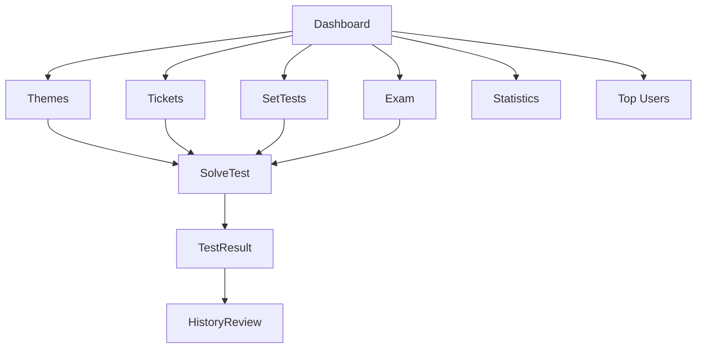

# 8. Frontend Mobile Web App

## Maqsad

Frontend React ilovasi userlar uchun mobilga mos test platforma, adminlar uchun boshqaruv paneli va managerlar uchun cheklangan panelni beradi. Ilova Telegram Mini App ichida ham, oddiy browserda ham ishlaydi.

## Asosiy fayllar

| Fayl | Vazifa |
|------|--------|
| `src/main.tsx` | React entry |
| `src/App.tsx` | Providerlar, Telegram WebApp integratsiyasi |
| `src/routes/AppRoutes.tsx` | Route map va guardlar |
| `src/utils/Backend.tsx` | User API client |
| `src/utils/Admin.tsx` | Admin API client |
| `src/contexts/ThemeContext.tsx` | Light/dark/system theme |
| `src/contexts/AlertContext.tsx` | Custom alert state |

## Route map

| Route | Component | Auth |
|-------|-----------|------|
| `/` | `Dashboard` | Ochiq |
| `/login` | `Login` | Ochiq |
| `/about` | `About` | Ochiq |
| `/connections` | `Connections` | Ochiq |
| `/profile` | `Profile` | User |
| `/settings` | `Settings` | Amalda route ochiq, ichida auth holatiga qaraydi |
| `/themes` | `ByTheme` | User |
| `/tickets` | `ByTicket` | User |
| `/settests` | `SetTests` | User |
| `/exam` | `ExamAutoStart` | User |
| `/testresult/:result_id` | `SolveTest` | User |
| `/test_result/:result_id` | `TestResult` | User |
| `/statistics` | `Statistics` | User |
| `/history` | `History` | User |
| `/history/:result_id` | `HistoryReview` | User |
| `/top` | `TopUsers` | User |
| `/daily-challenge` | `DailyTop` | User |
| `/admin/*` | `AdminDashboard` | Admin |
| `/manager/*` | `ManagerDashboard` | Manager yoki Admin |

## User flow

## API clientlar

### User client

`utils/Backend.tsx`:

| Method | Vazifa |
|--------|--------|
| `requestGet` | GET JSON |
| `requestPost` | POST JSON |
| `requestPut` | PUT JSON |
| `requestPatch` | PATCH JSON |
| `requestDelete` | DELETE JSON |
| `login` | `/auth/login/` |
| `logout` | `/auth/logout/` |
| `getProfile` | `/profile/` |
| `connectTelegram` | `/telegram/connect/` |

### Admin client

`utils/Admin.tsx` FormData va JSONni ajratib yuboradi. Uploadlarda `Content-Type`ni browserga qoldiradi.

## Local storage

| Key | Vazifa |
|-----|--------|
| `token` | Auth token |
| `userRole` | Role cache |
| `userFullName` | Ism cache |
| `userPermissions` | Manager permission cache |
| `coloring_enabled` | Ranglash yoqilganmi |
| `coloring_worked_themes` | Ishlangan mavzular |
| `coloring_worked_tickets` | Ishlangan biletlar |
| `testmode_ai` | AI mode |
| `testmode_ask_again` | Ask Again mode |
| `admin-theme` | Admin panel theme |

## Telegram WebApp UX

| Element | Koddagi ishlatilishi |
|---------|----------------------|
| `ready()` | App mount bo'lganda |
| `expand()` | Mini Appni to'liq ekran qilish |
| `BackButton` | Rootdan boshqa route'larda ko'rsatish |
| `HapticFeedback` | Tugmalar va test actionlarda |
| `initDataUnsafe.user.photo_url` | Login paytida backendga yuborish |

## Test yechish UI imkoniyatlari

`Solve.tsx` katta va boy komponent:

| Imkoniyat | Tavsif |
|-----------|--------|
| Timer | Exam uchun 20 daqiqalik hisob |
| Variant shortcut | Desktopda F1-F9, mobilda raqam label |
| Protected image | Rasm canvasga chiziladi, context menu/drag bloklanadi |
| Ask Again | Javobni tasdiqlashdan oldin qayta so'rash |
| AI Mode | Xato savol bo'yicha AI chat |
| Explanation | Savol va variant izohlarini ko'rsatish |
| Auto finish | Backend `finished` qaytarsa natija sahifasiga o'tish |
| Haptic | To'g'ri/xato/harakat feedback |

## Ranglash funksiyasi

`utils/coloring.ts` user ishlagan mavzu va biletlarni belgilaydi.

Flow:

1. Sahifa ochilganda `/coloring/`dan sync qiladi.
2. Test boshlanganda optimistik local `addWorked()` ishlaydi.
3. Backend `start_theme/start_ticket` user `coloring` JSONiga ID qo'shadi.
4. Modal orqali enabled yoki clear holatlari `/coloring/`ga PUT qilinadi.

## Admin va manager UI

| Component | Tavsif |
|-----------|--------|
| `AdminDashboard` | AdminShell, sidebar, topbar, KPI, charts |
| `ManagerDashboard` | `/manager/me/` orqali permissions olib AdminShellni filtrlaydi |
| `UserManagement` | User CRUD, manager create, ruxsat, reaktivatsiya |
| `TestsManagement` | Test, variant, rasm va izoh boshqaruvi |
| `ThemeManagement` | Mavzu CRUD |
| `TicketManagement` | Bilet CRUD |
| `ConnectionsManagement` | Telegram/phone/social links |
| `EndResults` | Yakuniy natijalar |
| `UsersStatisticsManagement` | Userlar statistikasi |

## UI dizayn prinsiplari

| Prinsip | Loyiha ichidagi ko'rinishi |
|---------|----------------------------|
| Mobile-first | Bottom nav, compact cards, Telegram safe-area |
| Dark mode | `ThemeContext`, admin tokens |
| Native-like feedback | Haptic, BackButton, fullscreen |
| Fast navigation | Dashboarddan test rejimlariga tez o'tish |
| Dense admin UI | Sidebar, table, filters, KPI cards |

## Tavsiyalar

1. `Settings` route auth guardini qat'iy qilish.
2. `Solve.tsx`ni kichik hook/componentlarga ajratish: timer, AI chat, answer state, image viewer.
3. API type'larini bitta `types/api.ts` fayliga chiqarish.
4. Role type'larini backend enum bilan moslashtirish.
5. Error handlingni barcha sahifalarda bir xil `CustomAlert` orqali yuritish.

