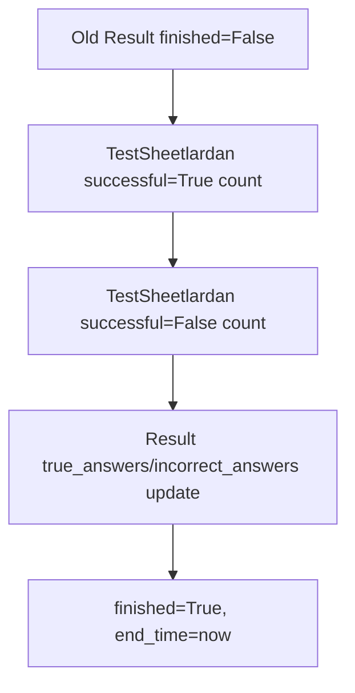
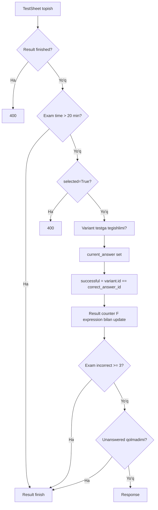

# 10. Test Tizimi va Imtihon Logikasi

## Test turlari

| Test turi | Backend enum | Boshlash endpointi | Tavsif |
|-----------|--------------|--------------------|--------|
| Mavzu | `THEME` | `/start_tests/start_theme/` | Bitta mavzudagi active testlar |
| Bilet | `TICKET` | `/start_tests/start_ticket/` | Bitta biletga tegishli active testlar |
| SetTest | `SETTEST` | `/start_tests/start_settest/` | Barcha active testlardan random `count` ta |
| Exam | `EXAM` | `/start_tests/start_exam/` | Real imtihon rejimi, odatda 20 ta savol |

## Start logikasi

Har bir start endpoint quyidagi umumiy ishlarni qiladi:

1. Kiruvchi ID yoki `count`ni oladi.
2. Active testlarni topadi.
3. Agar test yetarli bo'lmasa xato qaytaradi.
4. Shu userning eski `finished=False` resultlarini yakunlaydi.
5. Yangi `Result` yaratadi.
6. Tanlangan har bir test uchun `TestSheet` yaratadi.
7. Result serializer data qaytaradi.

## Eski aktiv sessiyani yakunlash

Yangi test boshlanganda eski unfinished resultlar quyidagicha yopiladi:



Bu userda bir vaqtning o'zida bir nechta aktiv test qolishini kamaytiradi.

## TestSheet roli

`Result` umumiy sessiya, `TestSheet` esa sessiyadagi har bitta savol holati.

| Field | Test jarayonidagi roli |
|-------|------------------------|
| `test` | Ko'rsatiladigan savol |
| `variant_orders` | Variant tartibi saqlanadi |
| `current_answer` | User tanlagan variant |
| `selected` | Savolga javob berilganmi |
| `successful` | Javob to'g'rimi |

## Javob berish logikasi

Endpoint:

```http
POST /api/solve_tests/{testsheet_id}/answer/
```

Flow:



## Exam qoidalari

| Qoida | Qiymat | Koddagi joy |
|-------|--------|-------------|
| Savollar soni | Default 20 | `start_exam` |
| Vaqt | 20 daqiqa | `SolveTestViewSet.answer` |
| Xato limiti | 3 ta | `SolveTestViewSet.answer` |
| O'tish mezoni | `true_answers >= 18` | Frontend result/status va admin stats |
| Ruxsat | `user.ruxsat=True` | `start_exam` |

## Finish logikasi

Manual finish:

```http
POST /api/solve_tests/{result_id}/finish/
```

Backend `TestSheet`lardan countni qayta hisoblaydi:

| Count | Query |
|-------|-------|
| To'g'ri | `successful=True` |
| Noto'g'ri | `successful=False` |
| Javobsiz | `selected=False` |

Keyin:

```text
finished=True
end_time=timezone.now()
```

## Result statistikasi

Endpoint:

```http
GET /api/result/{result_id}/statistics/
```

Response:

| Field | Tavsif |
|-------|--------|
| `id` | Result ID |
| `all` | Jami savol |
| `trues` | To'g'ri javob |
| `falses` | Noto'g'ri javob |
| `ignored` | Javobsiz |
| `description` | Result tavsifi |
| `percentage` | Foiz |
| `test_type` | Test turi |
| `finished` | Yakunlanganmi |

## Variant tartibi

`TestSheet.variant_orders` user ko'rgan variant tartibini saqlaydi. `SolveTestDetailView`da agar variantlar o'zgargan bo'lsa tartib qayta sinxron qilinadi.

`Test.random_order` frontendda variantlarni random ko'rsatish signalidir, ammo saqlangan order javobdan keyin tartib buzilmasligi uchun kerak.

## AI yordamchi

`Solve.tsx` AI chatni `/ai/chat/` orqali ishlatadi. Context:

| Context qismi | Manba |
|---------------|-------|
| Savol | `Test.value` |
| Variantlar | `Variant`lar |
| To'g'ri javob | `Test.correct_answer` |
| User xato javobi | `TestSheet.current_answer` |
| Bazadagi izoh | `Test.explanation` |

## Test sifati uchun tavsiyalar

1. Har bir active testda kamida 2 ta variant bo'lishi.
2. Har bir active testda `correct_answer` majburiy bo'lishi.
3. Rasmli savollarda image path ishlayotganini admin media proxy orqali tekshirish.
4. `Variant.explanation` va `Test.explanation`ni to'ldirish.
5. Muammoli testlar uchun Django admin `BrokenTestProxy`ni muntazam ko'rish.

