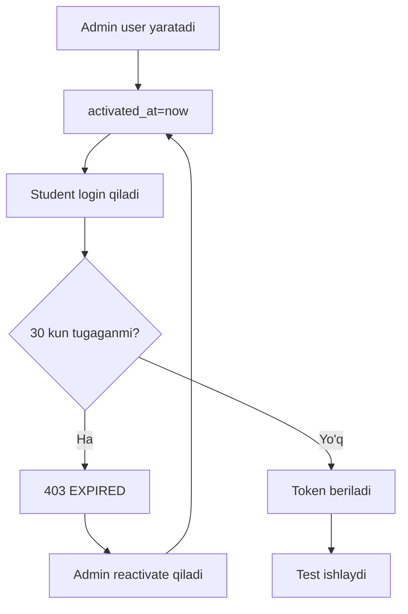

# 11. Obuna va Foydalanuvchi Boshqaruvi

## User lifecycle



## Obuna muddati

`User.activated_at` student akkaunti uchun 30 kunlik muddat boshlanishini bildiradi.

| User turi | Muddat qoidasi |
|-----------|----------------|
| `STUDENT` | `activated_at + 30 kun` |
| `ADMIN` | Cheksiz |
| `MANAGER` | Cheksiz |
| `is_staff=True` | Cheksiz |
| `is_superuser=True` | Cheksiz |

## Expired login response

Student muddati tugagan bo'lsa login 403 qaytaradi:

```json
{
  "detail": "Sizning obuna muddatingiz tugagan. Davom etish uchun admin bilan bog'laning.",
  "code": "EXPIRED"
}
```

## Reaktivatsiya

`User.reactivate()`:

```python
self.activated_at = timezone.now()
self.save(update_fields=["activated_at"])
```

Admin frontendda userni reaktivatsiya qilish uchun `activated_at`ni hozirgi vaqtga PUT qiladi.

## Ruxsat

`User.ruxsat` imtihonga kirish ruxsatini bildiradi.

| Holat | Natija |
|-------|--------|
| `ruxsat=True` | Student exam boshlay oladi |
| `ruxsat=False` | Student examda bloklanadi |
| Admin/staff | Ruxsat cheklovi qo'llanmaydi |

Frontend exam bloklanganida `/public/connection/`dan Telegram/phone/social ma'lumotlarni olib, admin bilan bog'lanishni ko'rsatadi.

## User yaratish

Student yaratish:

```http
POST /api/admin/user/

{
  "username": "student1",
  "password": "secret",
  "full_name": "Student One"
}
```

Manager yaratish:

```http
POST /api/admin/manager/

{
  "username": "manager1",
  "password": "secret",
  "full_name": "Manager One",
  "permissions": ["users", "tests"]
}
```

## User update

Endpoint:

```http
PUT /api/admin/user/{id}/
```

Update fieldlari:

| Field | Izoh |
|-------|------|
| `username` | Login |
| `password` | Yangi parol, optional |
| `full_name` | To'liq ism |
| `role` | ADMIN/MANAGER/STUDENT |
| `ruxsat` | Exam ruxsati |
| `permissions` | Manager capability list |
| `photo_url` | Profil rasmi |
| `activated_at` | Obuna boshlanishi |

Cheklovlar:

| Cheklov | Sabab |
|---------|-------|
| User o'zini update qila olmaydi | Admin xatosini kamaytirish |
| Staff user update qilinmaydi | Superuser himoyasi |
| User o'zini delete qila olmaydi | Lockout oldini olish |
| Staff user delete qilinmaydi | Superuser himoyasi |

## User list va filter

Admin user list querylari:

| Param | Misol |
|-------|-------|
| `search` | `?search=ali` |
| `role` | `?role=STUDENT` |
| `status` | `?status=true` |
| `sort_field` | `?sort_field=activated_at` |
| `sort_dir` | `?sort_dir=asc` |
| `page` | `?page=2` |
| `page_size` | `?page_size=50` |

Response:

```json
{
  "results": [],
  "pagination": {
    "page": 1,
    "page_size": 50,
    "total": 666,
    "total_pages": 14
  },
  "summary": {
    "total_all": 666,
    "admin_count": 1,
    "manager_count": 2,
    "student_count": 663
  }
}
```

## Telegram profil bilan bog'lash

User model Telegram fieldlari:

| Field | Tavsif |
|-------|--------|
| `telegram_id` | Telegram account ID, unique |
| `telegram_username` | Username |
| `photo_url` | Avatar |

Connect flow code orqali ishlaydi va boshqa userga ulangan Telegram IDni rad etadi.

## User statistikasi

| Endpoint | Ma'lumot |
|----------|----------|
| `GET /api/statistics/` | User o'z statistikasi |
| `GET /api/admin/user_statistics/{id}/` | Admin user statistikasi |
| `GET /api/admin/all_users_stats/` | Barcha user statistikasi |
| `GET /api/admin/user_history/{id}/` | User result tarixi |

## Foydalanuvchi boshqaruvi tavsiyalari

1. `activated_at` va `days_remaining`ni profil API responsega qo'shish foydali.
2. Role o'zgarganda manager permissions avtomatik tozalansin yoki validatsiya qilinsin.
3. User delete o'rniga soft-delete yoki `is_active=False` ishlatish xavfsizroq.
4. Sessionlarni admin panelda revoke qilish imkonini qo'shish.
5. Subscription audit log qo'shish: kim, qachon, necha kunga aktiv qildi.

