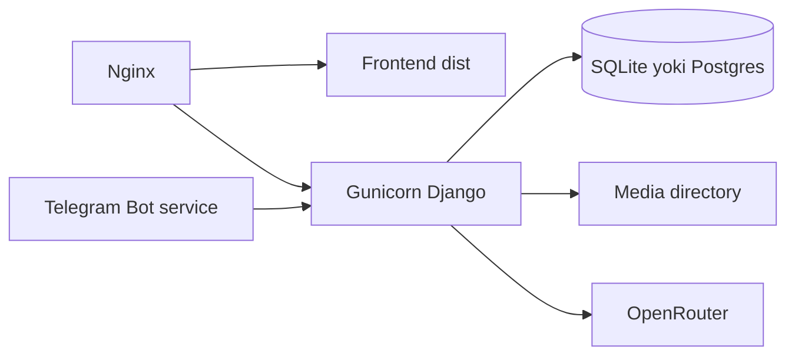

# 14. Deploy va Infrastruktura

## Production komponentlari



## Backend deploy

### Muhit

```bash
cd BackendAvtotester.uz
python -m venv venv
source venv/bin/activate
pip install -r requirements.txt
python manage.py migrate
python manage.py collectstatic
gunicorn config.wsgi:application -b 127.0.0.1:8000
```

### Environment variables

| Variable | Tavsif |
|----------|--------|
| `SECRET_KEY` | Django secret key |
| `OPENROUTER_API_KEY` | AI chat uchun |
| `OPENROUTER_MODEL` | Default `deepseek/deepseek-v4-flash` |
| `BOT_TOKEN` | Bot service uchun |
| `BACKEND_API_URL` | Botdan backendga murojaat |

`.env.example` Postgres fieldlarini ko'rsatadi, ammo settings hozir ulardan foydalanmaydi. Postgresga o'tish uchun settingsni env asosida yangilash kerak.

## Frontend deploy

```bash
cd FrontAvtotester.uz
npm install
npm run build
```

Build natijasi:

```text
FrontAvtotester.uz/dist/
```

Frontend env:

```env
VITE_BACKEND_URL=https://api.avtotester.uz/api
```

## Nginx frontend namunasi

```nginx
server {
    listen 80;
    server_name avtotester.uz www.avtotester.uz;

    root /var/www/avtotester/dist;
    index index.html;

    location / {
        try_files $uri $uri/ /index.html;
    }
}
```

## Nginx backend namunasi

```nginx
server {
    listen 80;
    server_name api.avtotester.uz;

    client_max_body_size 5M;

    location / {
        proxy_pass http://127.0.0.1:8000;
        proxy_set_header Host $host;
        proxy_set_header X-Real-IP $remote_addr;
        proxy_set_header X-Forwarded-For $proxy_add_x_forwarded_for;
        proxy_set_header X-Forwarded-Proto $scheme;
    }

    location /media/ {
        alias /path/to/BackendAvtotester.uz/media/;
    }

    location /static/ {
        alias /path/to/BackendAvtotester.uz/static/;
    }
}
```

## Backend systemd service

```ini
[Unit]
Description=AvtoTester Django API
After=network.target

[Service]
User=www-data
Group=www-data
WorkingDirectory=/path/to/BackendAvtotester.uz
EnvironmentFile=/path/to/BackendAvtotester.uz/.env
ExecStart=/path/to/BackendAvtotester.uz/venv/bin/gunicorn config.wsgi:application -b 127.0.0.1:8000
Restart=always
RestartSec=5

[Install]
WantedBy=multi-user.target
```

## Telegram bot systemd service

```ini
[Unit]
Description=AvtoTester Telegram Bot
After=network.target

[Service]
User=www-data
Group=www-data
WorkingDirectory=/path/to/BackendAvtotester.uz/Bot
EnvironmentFile=/path/to/BackendAvtotester.uz/.env
ExecStart=/path/to/BackendAvtotester.uz/venv/bin/python main.py
Restart=always
RestartSec=5

[Install]
WantedBy=multi-user.target
```

## Static va media

| Qism | Deploy strategiya |
|------|-------------------|
| Frontend dist | Nginx static root |
| Django static | `collectstatic`, Nginx alias |
| Media | Persistent disk yoki object storage |
| Telegram avatars | Media ichida persistent |
| DB | SQLite bo'lsa persistent volume, Postgres bo'lsa managed DB |

## SQLitedan Postgresga o'tish rejasi

Joriy DBda `api_testsheet` 2M+ yozuvga ega. Katta yuklamada Postgres tavsiya qilinadi.

Bosqichlar:

1. Settingsda `DATABASE_URL` yoki `DB_*` envlarni qo'llash.
2. Postgres DB yaratish.
3. `dumpdata`/`loaddata` yoki ETL orqali migration.
4. Indekslarni qo'shish.
5. Read-only maintenance windowda final sync.
6. Rollback plan tayyorlash.

## Monitoring

Admin dashboard server holatini qaytaradi:

| Metric | Manba |
|--------|-------|
| CPU percent | `psutil.cpu_percent()` |
| RAM used | `psutil.virtual_memory()` |
| Disk used | `psutil.disk_usage("/")` |

Lekin total CPU/RAM/DISK hardcoded. Productionda buni real serverdan yoki envdan olish tavsiya qilinadi.

## Backup

| Qism | Tavsiya |
|------|---------|
| SQLite | Har kuni DB fayl snapshot, service stop yoki consistent backup |
| Media | Har kuni incremental backup |
| Env | Secret manager, backup emas, qayta tiklash hujjati |
| Frontend dist | Git/build pipeline orqali qayta yaratiladi |

## Deploy checklist

1. `DEBUG=False`.
2. `SECRET_KEY` kuchli va envda.
3. `ALLOWED_HOSTS` faqat real domainlar.
4. `CORS_ALLOWED_ORIGINS` whitelist.
5. HTTPS sertifikat.
6. Nginx `client_max_body_size 5M`.
7. Gunicorn worker soni serverga mos.
8. Bot service envlari to'g'ri.
9. `python manage.py check --deploy`.
10. Frontend `npm run build` muvaffaqiyatli.
11. Backup restore sinovi.

