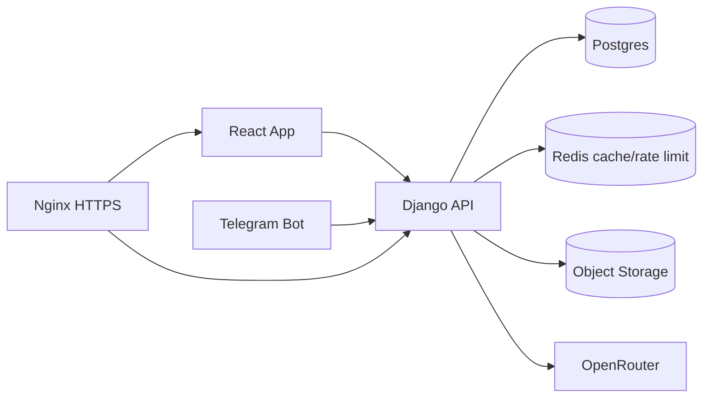

# 17. Kelajakdagi Rivojlantirish Roadmap

## Roadmap maqsadi

Ushbu roadmap AvtoTester.uz loyihasini barqaror, xavfsiz, tez va kengaytiriladigan holatga olib chiqish uchun tuzildi. Takliflar hozirgi kod bazasi, DB hajmi va mavjud featurelarga asoslangan.

## 0-2 hafta: xavfsizlik va production sozlamalari

| Ish | Sabab | Prioritet |
|-----|-------|-----------|
| `DEBUG=False`ni env orqali boshqarish | Production xavfsizligi | Yuqori |
| `SECRET_KEY` fallbackini olib tashlash | Insecure default oldini olish | Yuqori |
| Bot tokenni koddan chiqarish | Secret leak riskini yopish | Yuqori |
| CORS whitelist | API misuse riskini kamaytirish | Yuqori |
| `/api/ai/chat/` auth qo'shish | Boshqa user savollariga access riskini yopish | Yuqori |
| Login va Telegram code rate limit | Brute force oldini olish | Yuqori |
| `.gitignore`ni tiklash | Media/node_modules/dist tracking oldini olish | Yuqori |

## 2-4 hafta: API va DB barqarorligi

| Ish | Sabab | Prioritet |
|-----|-------|-----------|
| Result/TestSheet indekslar | 2M+ TestSheet yozuvda tezlik | Yuqori |
| Postgres migratsiya rejasi | SQLite limitlarini kamaytirish | Yuqori |
| API error format standard | Frontend error handlingni soddalashtirish | O'rta |
| Pagination hamma admin listlarga | Katta datasetlarda UI tezligi | O'rta |
| Permission matrix testlari | Manager access drift oldini olish | Yuqori |
| OpenAPI schema to'ldirish | API docs avtomatik aniq bo'lishi | O'rta |

## 1-2 oy: frontend sifatini oshirish

| Ish | Sabab | Prioritet |
|-----|-------|-----------|
| `Solve.tsx`ni modullarga ajratish | Maintainability | Yuqori |
| Shared API types | Type mismatchlarni kamaytirish | O'rta |
| Error boundary | Runtime xatolarda yaxshi UX | O'rta |
| Offline/retry holatlari | Mobil internetda barqarorlik | O'rta |
| Admin table virtualization | Katta listlarda performance | O'rta |
| Accessibility pass | Keyboard/screen reader support | Past/O'rta |

## 2-3 oy: kontent va test sifati

| Ish | Sabab | Prioritet |
|-----|-------|-----------|
| Muammoli testlar dashboardi | `correct_answer` yoki variant yetishmasligini tez topish | Yuqori |
| Savol/variant izohi coverage | AI va review sifatini oshirish | O'rta |
| Bulk import/export | Test bazasini tez yangilash | Yuqori |
| Image optimization pipeline | Media hajmini kamaytirish | O'rta |
| Duplicate question detection | Kontent sifatini oshirish | O'rta |
| Topic weakness analytics | O'quvchiga foydali tavsiya | O'rta |

## 3-6 oy: mahsulot imkoniyatlari

| Feature | Tavsif |
|---------|--------|
| Adaptive learning | User ko'p xato qilgan mavzulardan avtomatik test |
| Payment/subscription | 30 kunlik obunani avtomatlashtirish |
| Certificate/result share | Exam natijasini share qilish |
| Push/Telegram reminder | Kunlik mashq eslatmalari |
| Multi-language polish | Lotin/kirill mappingni to'liq standartlashtirish |
| Teacher/Group mode | Guruhlar va instruktor dashboard |

## Texnik qarzlar

| Qarz | Hozirgi holat | Yechim |
|------|---------------|--------|
| Katta `Solve.tsx` | Test UI, AI, timer, image, shortcut bir joyda | Hook/componentlarga ajratish |
| Role type mismatch | Backend `STUDENT`, frontendda `USER` ham bor | Shared enum |
| Secret defaults | Bot token va secret fallback | Env-only |
| SQLite | Katta result/testsheet hajmi | Postgres |
| CORS all | Keng ruxsat | Whitelist |
| Admin server specs | Hardcoded | Real metric/env |

## Tavsiya etilgan yangi backend commandlar

| Command | Vazifa |
|---------|--------|
| `cleanup_orphan_media` | DBda yo'q media fayllarni topish/o'chirish |
| `recalculate_results` | Result counterlarini TestSheetdan qayta hisoblash |
| `find_broken_tests` | Variant/correct_answer/image muammolarini chiqarish |
| `archive_old_testsheets` | Eski test sheetlarni arxivlash |
| `export_questions` | Testlarni JSON/CSV export |
| `import_questions` | Bulk import |

## Tavsiya etilgan test coverage

| Qism | Test turi |
|------|-----------|
| Login | Unit/API |
| Expired user | API |
| Manager permissions | API matrix |
| Start test | API |
| Answer logic | Unit/API |
| Exam timeout/3 wrong | Unit/API |
| Telegram connect | API |
| Upload validation | API |
| Frontend route guards | Component/e2e |
| Admin CRUD | e2e smoke |

## Performance yo'nalishlari

1. `Result` va `TestSheet` indekslar.
2. Dashboard stats uchun cache.
3. Top ranking uchun materialized summary yoki scheduled aggregation.
4. Frontend bundle analiz.
5. Image compression va lazy loading.
6. Admin list pagination va search debounce.

## Yakuniy maqsad arxitekturasi

## Eng foydali keyingi 5 qadam

1. Production security sozlamalarini envga chiqarish.
2. `/api/ai/chat/`ni auth va ownership check bilan yopish.
3. DB indekslar va Postgres migration rejasini tayyorlash.
4. Media va build artefaktlarini gitdan ajratish.
5. Test boshlash/javob/exam logic uchun API testlar yozish.

